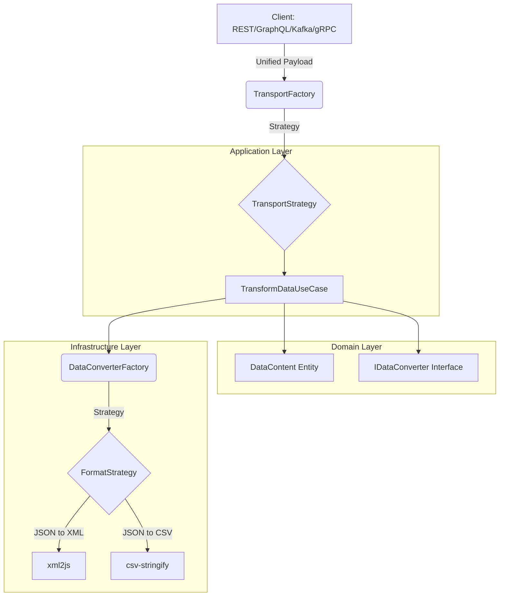

<p align="center">
  <a href="./README_EN.md">
    
  </a>
</p>

<div align="center" style="background-color: #d90429; padding: 20px; border-radius: 0px; width: full; margin: 0 auto;">
  
</div>

<br/>

# Data Bridge Service

**Data Bridge Service** es una solución robusta desarrollada con **NestJS** diseñada para transformar datos entre múltiples formatos y protocolos de transporte. Utiliza una **Arquitectura Hexagonal** y patrones de diseño avanzados para garantizar escalabilidad, mantenibilidad y un alto rendimiento.

## 📋 Tabla de Contenidos
- [Formatos Soportados](#-formatos-soportados)
- [Protocolos de Transporte](#-protocolos-de-transporte)
- [Guía de Instalación](#-guía-de-instalación)
- [Arquitectura del Proyecto](#-arquitectura-del-proyecto)
- [Patrones de Diseño](#-patrones-de-diseño)
- [Despliegue con Docker](#-despliegue-con-docker)
- [Pruebas](#-pruebas)
- [Contribución](#-contribución)

## 🔄 Formatos Soportados

El servicio permite la transformación bidireccional entre los siguientes formatos:
- **JSON**
- **XML**
- **CSV**
- **TOON** (Token-Oriented Object Notation)
- **SQL** (Próximamente)
- **Excel** (Próximamente)

## 🚀 Protocolos de Transporte

Puedes interactuar con el servicio a través de:
- **REST API**: Endpoint `POST /transform`.
- **GraphQL**: Mutación `transform`.
- **Kafka**: (En desarrollo).
- **gRPC**: (En desarrollo).

## 🚀 Guía de Instalación

### 1. Requisitos Previos
- **Node.js**: v18 o superior.
- **pnpm**: Instalador de paquetes.
- **Docker**: Para despliegue en contenedores.

### 2. Instalación Local
```bash
# Clonar el repositorio
git clone <url-del-repo>
cd data-bridge-service

# Instalar dependencias
pnpm install

# Configurar variables de entorno
cp .env.example .env # Ajusta el PORT a 3120
```

### 3. Ejecución
```bash
# Modo desarrollo
pnpm run start:dev

# Compilar y ejecutar
pnpm run build
pnpm run start:prod
```

## 🏗 Arquitectura del Proyecto

El proyecto sigue los principios de **Arquitectura Hexagonal (Clean Architecture)** y el principio **"Tell, Don't Ask"**.

### Diagrama de Arquitectura



## 🛠 Patrones de Diseño

Para cumplir con los requerimientos de diseño, se han implementado los siguientes patrones:
- **Strategy**: Para manejar diferentes formatos de datos y protocolos de transporte.
- **Factory**: Para instanciar la estrategia correcta dinámicamente.
- **Constants**: Centralización de formatos y tipos de transporte.
- **Builder**: Para la construcción de resultados de transformación complejos.
- **Translator**: Para el mapeo entre DTOs de infraestructura y Entidades de dominio.

## 🐳 Despliegue con Docker

### Dockerfile
El proyecto incluye un `Dockerfile` optimizado para producción.

### Docker Compose / Swarm
```bash
# Levantar con Docker Compose
docker-compose up -d
```

## 🧪 Pruebas

Para facilitar las pruebas de los endpoints REST y GraphQL, hemos incluido un archivo de exportación de Insomnia.

1.  Descarga e instala [Insomnia](https://insomnia.rest/).
2.  Importa el archivo `insomnia_export.json` ubicado en la raíz del proyecto.
3.  Verás una colección "Data Bridge Service" con ejemplos listos para usar.

### Ejemplos Manuales

#### 1. REST API (JSON -> XML)
**Endpoint:** `POST http://localhost:3120/transform`
**Body (JSON):**
```json
{
  "uuid": "123e4567-e89b-12d3-a456-426614174000",
  "service": "test-service",
  "transport": "rest",
  "from": "JSON",
  "to": "XML",
  "content": {
    "root": {
      "message": "Hola Mundo",
      "date": "2024-01-01"
    }
  }
}
```

#### 2. GraphQL (Mutation)
**Endpoint:** `http://localhost:3120/graphql`
**Query:**
```graphql
mutation {
  transform(
    uuid: "123e4567-e89b-12d3-a456-426614174001",
    service: "test-service",
    transport: GRAPHQL,
    from: JSON,
    to: XML,
    content: { root: { message: "Hola desde GraphQL" } }
  ) {
    success
    data
    error
  }
}
```

#### 3. REST API (JSON -> TOON)
**Endpoint:** `POST http://localhost:3120/transform`
**Body (JSON):**
```json
{
  "uuid": "123e4567-e89b-12d3-a456-426614174002",
  "service": "test-service",
  "transport": "rest",
  "from": "JSON",
  "to": "TOON",
  "content": {
    "user": {
      "name": "Alice",
      "age": 30,
      "active": true
    }
  }
}
```

**Respuesta esperada (TOON):**
```
user
  name: Alice
  age: 30
  active: true
```

#### 4. GraphQL (JSON -> CSV)
**Endpoint:** `http://localhost:3120/graphql`
**Query:**
```graphql
mutation {
  transform(
    uuid: "123e4567-e89b-12d3-a456-426614174003",
    service: "test-service",
    transport: GRAPHQL,
    from: JSON,
    to: CSV,
    content: [
      { id: 1, name: "Alice", role: "Admin" },
      { id: 2, name: "Bob", role: "User" }
    ]
  ) {
    success
    data
    error
  }
}
```

#### 5. GraphQL (JSON -> TOON)
**Endpoint:** `http://localhost:3120/graphql`
**Query:**
```graphql
mutation {
  transform(
    uuid: "123e4567-e89b-12d3-a456-426614174004",
    service: "test-service",
    transport: GRAPHQL,
    from: JSON,
    to: TOON,
    content: {
      product: {
        name: "Laptop",
        price: 999.99,
        inStock: true
      }
    }
  ) {
    success
    data
    error
  }
}
```

#### 6. REST API (XML -> TOON)
**Endpoint:** `POST http://localhost:3120/transform`
**Body (JSON):**
```json
{
  "uuid": "123e4567-e89b-12d3-a456-426614174005",
  "service": "test-service",
  "transport": "rest",
  "from": "XML",
  "to": "TOON",
  "content": "<root><message>Hello</message></root>"
}
```

#### 7. REST API (TOON -> XML)
**Endpoint:** `POST http://localhost:3120/transform`
**Body (JSON):**
```json
{
  "uuid": "123e4567-e89b-12d3-a456-426614174006",
  "service": "test-service",
  "transport": "rest",
  "from": "TOON",
  "to": "XML",
  "content": "root\n  message: Hello"
}
```

## 🤝 Contribución

¡Las contribuciones son bienvenidas! Para colaborar:
1. Implementa nuevas estrategias en `src/infrastructure/converters/strategies`.
2. Registra la estrategia en el `TransformationModule`.
3. Asegúrate de seguir el principio **Tell, Don't Ask**.

## 👥 Autor

<div align="center">
  
  <br />
  <strong>Luis Arcángel Farro Terán (LAFT)</strong>
  <br />
  <a href="https://github.com/laft17s">@laft17s</a>
</div>

---
License: UNLICENSED
