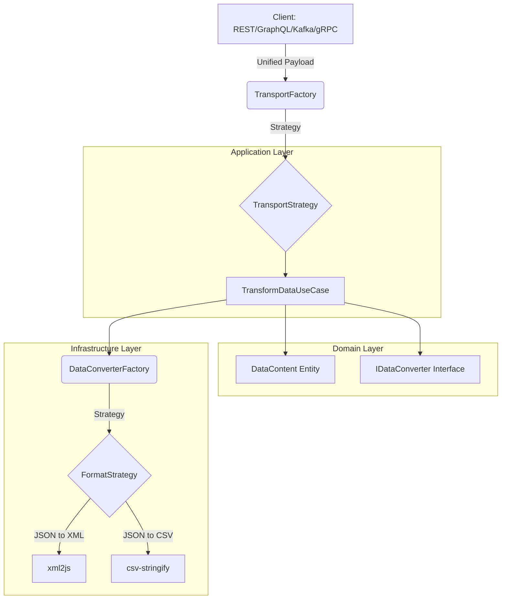

<p align="center">
  <a href="./README_EN.md">
    
  </a>
</p>

<div align="center" style="background-color: #d90429; padding: 20px; border-radius: 0px; width: full; margin: 0 auto;">
  
</div>

<br/>

# Data Bridge Service

**Data Bridge Service** is a robust solution developed with **NestJS** designed to transform data between multiple formats and transport protocols. It utilizes **Hexagonal Architecture** and advanced design patterns to ensure scalability, maintainability, and high performance.

## 📋 Table of Contents
- [Supported Formats](#-supported-formats)
- [Transport Protocols](#-transport-protocols)
- [Installation Guide](#-installation-guide)
- [Project Architecture](#-project-architecture)
- [Design Patterns](#-design-patterns)
- [Docker Deployment](#-docker-deployment)
- [Testing](#-testing)
- [Contribution](#-contribution)

## 🔄 Supported Formats

The service allows bidirectional transformation between the following formats:
- **JSON**
- **XML**
- **CSV**
- **TOON** (Token-Oriented Object Notation)
- **SQL** (Coming Soon)
- **Excel** (Coming Soon)

## 🚀 Transport Protocols

You can interact with the service through:
- **REST API**: Endpoint `POST /transform`.
- **GraphQL**: Mutation `transform`.
- **Kafka**: (In development).
- **gRPC**: (In development).

## 🚀 Installation Guide

### 1. Prerequisites
- **Node.js**: v18 or higher.
- **pnpm**: Package manager.
- **Docker**: For containerized deployment.

### 2. Local Installation
```bash
# Clone the repository
git clone <repo-url>
cd data-bridge-service

# Install dependencies
pnpm install

# Configure environment variables
cp .env.example .env # Set PORT to 3120
```

### 3. Execution
```bash
# Development mode
pnpm run start:dev

# Build and run
pnpm run build
pnpm run start:prod
```

## 🏗 Project Architecture

The project follows **Hexagonal Architecture (Clean Architecture)** principles and the **"Tell, Don't Ask"** principle.

### Architecture Diagram



## 🛠 Design Patterns

To meet the design requirements, the following patterns have been implemented:
- **Strategy**: To handle different data formats and transport protocols.
- **Factory**: To instantiate the correct strategy dynamically.
- **Constants**: Centralization of formats and transport types.
- **Builder**: For constructing complex transformation results.
- **Translator**: For mapping between infrastructure DTOs and domain Entities.

## 🐳 Docker Deployment

### Dockerfile
The project includes a `Dockerfile` optimized for production.

### Docker Compose / Swarm
```bash
# Spin up with Docker Compose
docker-compose up -d
```

## 🧪 Testing

To facilitate testing of REST and GraphQL endpoints, we have included an Insomnia export file.

1.  Download and install [Insomnia](https://insomnia.rest/).
2.  Import the `insomnia_export.json` file located at the project root.
3.  You will see a "Data Bridge Service" collection with ready-to-use examples.

### Manual Examples

#### 1. REST API (JSON -> XML)
**Endpoint:** `POST http://localhost:3120/transform`
**Body (JSON):**
```json
{
  "uuid": "123e4567-e89b-12d3-a456-426614174000",
  "service": "test-service",
  "transport": "rest",
  "from": "JSON",
  "to": "XML",
  "content": {
    "root": {
      "message": "Hello World",
      "date": "2024-01-01"
    }
  }
}
```

#### 2. GraphQL (Mutation)
**Endpoint:** `http://localhost:3120/graphql`
**Query:**
```graphql
mutation {
  transform(
    uuid: "123e4567-e89b-12d3-a456-426614174001",
    service: "test-service",
    transport: GRAPHQL,
    from: JSON,
    to: XML,
    content: { root: { message: "Hello from GraphQL" } }
  ) {
    success
    data
    error
  }
}
```

#### 3. REST API (JSON -> TOON)
**Endpoint:** `POST http://localhost:3120/transform`
**Body (JSON):**
```json
{
  "uuid": "123e4567-e89b-12d3-a456-426614174002",
  "service": "test-service",
  "transport": "rest",
  "from": "JSON",
  "to": "TOON",
  "content": {
    "user": {
      "name": "Alice",
      "age": 30,
      "active": true
    }
  }
}
```

**Expected response (TOON):**
```
user
  name: Alice
  age: 30
  active: true
```

#### 4. GraphQL (JSON -> CSV)
**Endpoint:** `http://localhost:3120/graphql`
**Query:**
```graphql
mutation {
  transform(
    uuid: "123e4567-e89b-12d3-a456-426614174003",
    service: "test-service",
    transport: GRAPHQL,
    from: JSON,
    to: CSV,
    content: [
      { id: 1, name: "Alice", role: "Admin" },
      { id: 2, name: "Bob", role: "User" }
    ]
  ) {
    success
    data
    error
  }
}
```

#### 5. GraphQL (JSON -> TOON)
**Endpoint:** `http://localhost:3120/graphql`
**Query:**
```graphql
mutation {
  transform(
    uuid: "123e4567-e89b-12d3-a456-426614174004",
    service: "test-service",
    transport: GRAPHQL,
    from: JSON,
    to: TOON,
    content: {
      product: {
        name: "Laptop",
        price: 999.99,
        inStock: true
      }
    }
  ) {
    success
    data
    error
  }
}
```

#### 6. REST API (XML -> TOON)
**Endpoint:** `POST http://localhost:3120/transform`
**Body (JSON):**
```json
{
  "uuid": "123e4567-e89b-12d3-a456-426614174005",
  "service": "test-service",
  "transport": "rest",
  "from": "XML",
  "to": "TOON",
  "content": "<root><message>Hello</message></root>"
}
```

#### 7. REST API (TOON -> XML)
**Endpoint:** `POST http://localhost:3120/transform`
**Body (JSON):**
```json
{
  "uuid": "123e4567-e89b-12d3-a456-426614174006",
  "service": "test-service",
  "transport": "rest",
  "from": "TOON",
  "to": "XML",
  "content": "root\n  message: Hello"
}
```

## 🤝 Contribution

Contributions are welcome! To collaborate:
1. Implement new strategies in `src/infrastructure/converters/strategies`.
2. Register the strategy in `TransformationModule`.
3. Ensure you follow the **Tell, Don't Ask** principle.

## 👥 Autor

<div align="center">
  
  <br />
  <strong>Luis Arcángel Farro Terán (LAFT)</strong>
  <br />
  <a href="https://github.com/laft17s">@laft17s</a>
</div>

---
License: UNLICENSED
